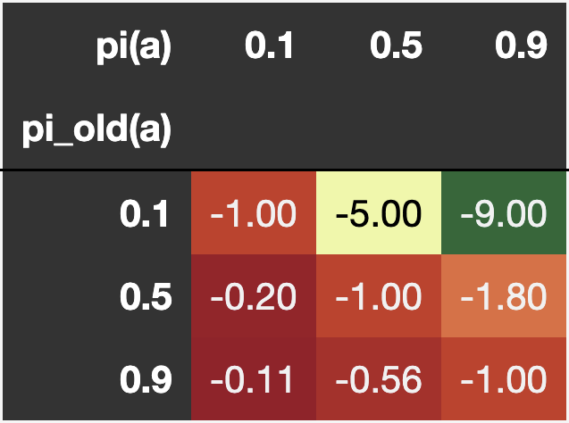
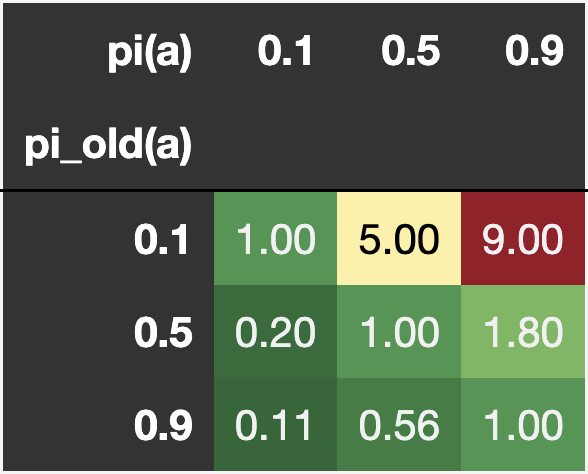
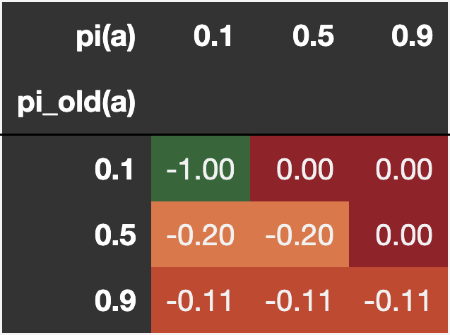
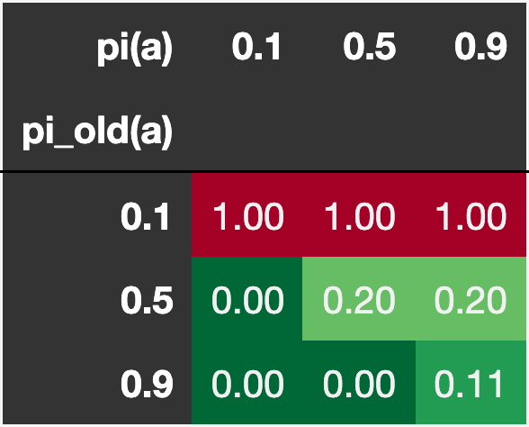
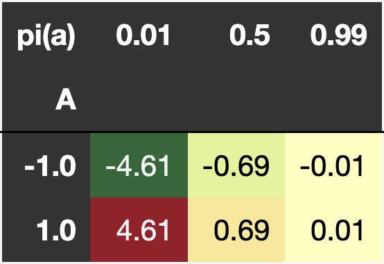
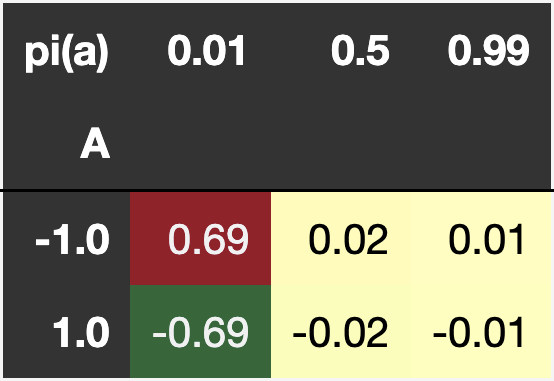

# Visualizing RL Loss Functions

## PPO loss

loss = -min(ratio * A, clip(ratio, 1 - e, 1 + e) * A)

ratio = pi(a) / pi_old(a)

e = 0.1

#### A=1

#### A=-1

### Loss deltas

This shows how much the loss changes when pi(a) changes by +0.01. The diagonal is the most relevant as it won't get clipped and the non-clipped are the same on each row since:
L_delta = (pi_a + delta) * A - pi_a * A = delta * A. 

#### A=10

#### A=-10

- Improvement where pi_old(a) is low results in much bigger loss changes.
- The loss gets clipped where the improvement is high with and without delta resulting in delta=0.

## REINFORCE loss

loss = -log(pi(a)) * A

#### Loss Delta

This shows how much the loss changes when pi(a) changes by +0.01.

- The loss changes drastically more when pi(a) is low since log(pi(a)) grows hyperbolically as pi(a) approaches 0.
